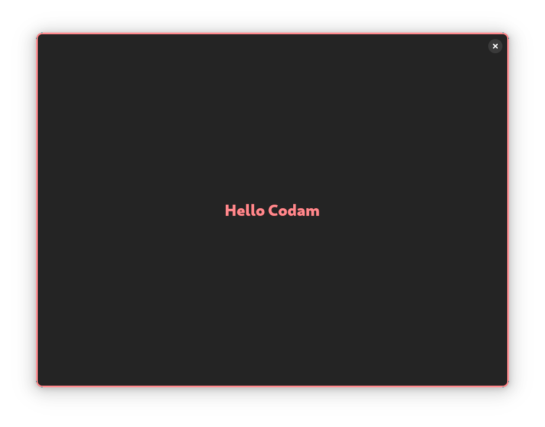

# Hello to all students at Codam!

Welcome to the world of programming in **C** using **GTK4** and **libadwaita**.

<p align="center">
  
</p>

# [Makefile](https://github.com/RustPanda/hello_codam/blob/main/Makefile)
```makefile
NAME = hello_codam

CC = gcc
CFLAGS = `pkg-config --cflags gtk4 libadwaita-1` -Wall -Wextra -Werror -O2
LDFLAGS = `pkg-config --libs gtk4 libadwaita-1`

SRCDIR = src
OBJDIR = obj

SRCS = $(wildcard $(SRCDIR)/*.c)
OBJS = $(SRCS:$(SRCDIR)/%.c=$(OBJDIR)/%.o)

all: $(NAME)

$(NAME): $(OBJS)
	$(CC) -o $@ $^ $(LDFLAGS)

$(OBJDIR)/%.o: $(SRCDIR)/%.c | $(OBJDIR)
	$(CC) -c $< -o $@ $(CFLAGS)

$(OBJDIR):
	mkdir -p $(OBJDIR)

clean:
	rm -rf $(OBJDIR)

fclean: clean
	rm -f $(NAME)

re: fclean all

.PHONY: all clean fclean re
```

# [main.c](https://github.com/RustPanda/hello_codam/blob/main/src/main.c)
```c
/* ************************************************************************** */
/*                                                                            */
/*                                                        ::::::::            */
/*   main.c                                             :+:    :+:            */
/*                                                     +:+                    */
/*   By: mgolubev <mgolubev@student.codam.nl>         +#+                     */
/*                                                   +#+                      */
/*   Created: 2024/10/24 20:33:50 by mgolubev      #+#    #+#                 */
/*   Updated: 2024/12/22 12:34:43 by maria         ########   odam.nl         */
/*                                                                            */
/* ************************************************************************** */

#include <gtk/gtk.h>
#include <adwaita.h>

#define CSS ".meoww {border: 3px solid @accent_color; border-radius: 10px;}"

static GtkWidget	*f_new_header_bar(void)
{
	AdwHeaderBar	*header_bar;

	header_bar = ADW_HEADER_BAR(adw_header_bar_new());
	gtk_widget_set_hexpand(GTK_WIDGET(header_bar), TRUE);
	gtk_widget_set_vexpand(GTK_WIDGET(header_bar), FALSE);
	gtk_widget_set_valign(GTK_WIDGET(header_bar), GTK_ALIGN_START);
	gtk_widget_add_css_class(GTK_WIDGET(header_bar), "flat");
	adw_header_bar_set_show_title(header_bar, FALSE);
	return (GTK_WIDGET(header_bar));
}

static GtkWidget	*f_new_status_page(void)
{
	AdwStatusPage	*status_page;

	status_page = ADW_STATUS_PAGE(adw_status_page_new());
	gtk_widget_set_hexpand(GTK_WIDGET(status_page), TRUE);
	gtk_widget_set_vexpand(GTK_WIDGET(status_page), TRUE);
	adw_status_page_set_title(status_page, "Hello Codam");
	gtk_widget_add_css_class(GTK_WIDGET(status_page), "accent");
	gtk_widget_add_css_class(GTK_WIDGET(status_page), "meoww");
	return (GTK_WIDGET(status_page));
}

static void	f_set_css_provider(const char *css)
{
	GtkCssProvider	*css_provider;
	GdkDisplay		*display;

	css_provider = gtk_css_provider_new();
	display = gdk_display_get_default();
	gtk_css_provider_load_from_string(css_provider, css);
	gtk_style_context_add_provider_for_display(display,
		GTK_STYLE_PROVIDER(css_provider),
		GTK_STYLE_PROVIDER_PRIORITY_APPLICATION);
}

static void	on_activate(GtkApplication *app, gpointer ptr)
{
	AdwApplicationWindow	*window;
	GtkWidget				*overlay;

	(void)ptr;
	overlay = gtk_overlay_new();
	gtk_overlay_set_child(GTK_OVERLAY(overlay), f_new_status_page());
	gtk_overlay_add_overlay(GTK_OVERLAY(overlay), f_new_header_bar());
	window = ADW_APPLICATION_WINDOW(adw_application_window_new(app));
	gtk_window_set_title(GTK_WINDOW(window), "Hello Codam!");
	gtk_window_set_default_size(GTK_WINDOW(window), 800, 600);
	adw_application_window_set_content(window, overlay);
	f_set_css_provider(CSS);
	gtk_window_present(GTK_WINDOW(window));
}

int	main(int argc, char *argv[])
{
	AdwApplication	*app;
	int				status;

	adw_init();
	app = adw_application_new("org.gtk.example", G_APPLICATION_DEFAULT_FLAGS);
	g_signal_connect(app, "activate", G_CALLBACK(on_activate), NULL);
	status = g_application_run(G_APPLICATION(app), argc, argv);
	g_object_unref(app);
	return (status);
}
```
